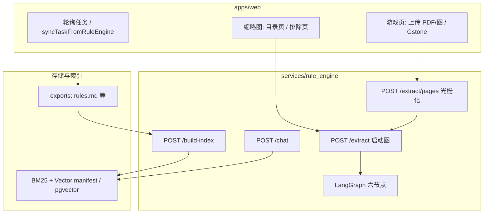
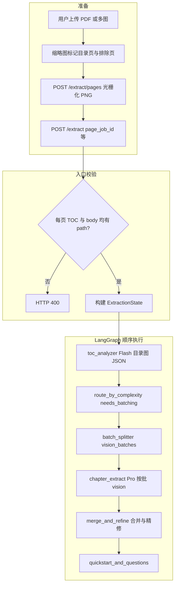
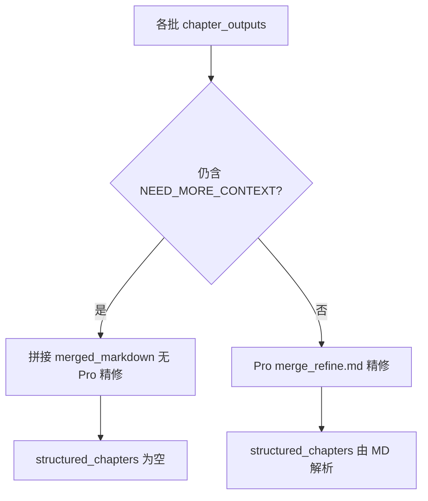
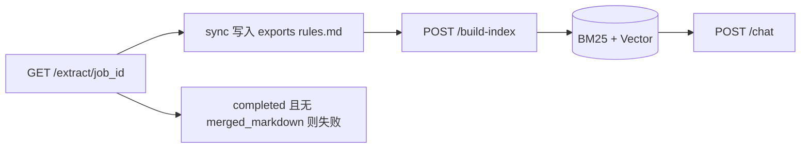
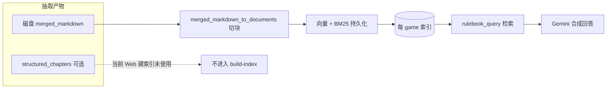

# 规则抽取流程说明（Extract → Index → Chat）

本文描述 **当前实现** 下的端到端数据流：从 Web/API 上传与选页，到 LangGraph 节点、轮询结果，再到建索引与对话检索。实现代码以 `graphs/`、`api/routers/extract.py`、`ingestion/index_builder.py`、`ingestion/rulebook_query.py` 为准。

---

## 1. 总览图（系统边界）

---

## 2. LangGraph 拓扑（抽取管线）

图为 **线性**：节点顺序不变；**产品级分流**在 `route_by_complexity` 与 `batch_splitter` 中完成（见下「抽取策略」）。

### 2.1 抽取策略（单一配置表）

| 概念 | 含义 |
|------|------|
| **简单路径** | 正文页数 ≤ `EXTRACTION_SIMPLE_MAX_BODY_PAGES`（默认 **10**），且 **`force_full_pipeline` 为 false** → `needs_batching=false`，`batch_splitter` 在模型与图片上限内 **尽量单批覆盖全部正文页**（薄册高保真、少 merge）。 |
| **复杂路径** | 正文页数 **大于** 上述阈值，或 **`force_full_pipeline` 为 true** → 进入复杂侧路由；`needs_batching` 由 TOC、章节数、估算体量、`EXTRACTION_COMPLEX_ROUTE_BODY_PAGES`（默认 15；**弃用名** `COMPLEXITY_THRESHOLD_PAGES`）等共同决定。 |
| **强制全量流程** | `POST /extract` 的表单字段 **`force_full_pipeline`**：跳过简单路径门闸，用于厚册或与 Dify 多阶段管线对齐对比。 |

**谁在读取哪些变量**（实现入口：`graphs/extraction_settings.py`、`graphs/nodes/route_by_complexity.py`、`graphs/nodes/batch_splitter.py`）：

| 变量 / 字段 | 默认 | 作用 |
|-------------|------|------|
| `EXTRACTION_SIMPLE_MAX_BODY_PAGES` | 10 | 简单路径门闸（正文页数上限，含等号侧为简单）。 |
| `EXTRACTION_COMPLEX_ROUTE_BODY_PAGES` | 15 | 仅 **复杂路径** 内：正文页数大于该值时参与 `needs_batching` 判定。 |
| `COMPLEXITY_THRESHOLD_PAGES` | — | **弃用**，与 `EXTRACTION_COMPLEX_ROUTE_BODY_PAGES` 同义；未设置新变量时仍读取此项。 |
| `VISION_BATCH_PAGES` | 6 | 仅 **`needs_batching=true`** 时按该页数切段；简单路径下单批页数不受此上限约束（见 `batch_splitter`）。 |
| `force_full_pipeline` | false | API / Web 传入，写入 `ExtractionState`；为 true 时不走简单门闸。 |
| `EXTRACTION_SIMPLE_PATH_WARN_BODY_PAGES` | 32 | 简单路径单批覆盖正文超过该页数时打 **warning** 日志（提示可能触 API 或质量上限）。 |

轮询结果含 **`complexity`**、**`extraction_profile`**（`simple` \| `complex`）、**`toc`**，便于排查当前路径。

**人工验收样例与 Dify 对照说明**：`tests/fixtures/EXTRACTION_ACCEPTANCE.md`。

---

## 3. 业务步骤（Mermaid）

下列图为与实现一致的顺序；细节见各节点与 `extract.py`。

### 3.1 准备、入口校验与 LangGraph 执行

说明：未在 UI 选目录页时，引擎可将 **第 1 页** 默认作为目录（见 `extract.py`）。**`chapter_extract` 节点内部**：若某批输出含 `NEED_MORE_CONTEXT`，会在上限内 **合并相邻图片批次** 再次调用 Pro（非图中的独立节点）。

### 3.2 merge 对 NEED_MORE_CONTEXT 的分支（逻辑在 `merge_and_refine` 内）

### 3.3 轮询、落盘、建索引与聊天

---

## 4. 与 Index / Chat 的衔接（Mermaid）

**结论**：只要 **`merged_markdown` 质量与页码标记** 满足 `node_builders` 的解析假设，即满足 **index + chat**；`structured_chapters` 为增强/调试用途，非当前 Web 建索引主路径。

### 4.1 页码锚点格式（`merged_markdown` → 向量元数据）

建索引时 `ingestion/node_builders.py` 按 **HTML 注释** 切分章节，并把页码写进每个 chunk 的 metadata（供引用与检索过滤）：

- **推荐写法**（与正则一致）：
  - 单页：`<!-- pages: 12 -->`
  - 连续页：`<!-- pages: 3-7 -->`（可用连字符 `-` 或 en dash `–`）
- **锚点之后**的第一段正文会继承该页码范围，直到下一个 `<!-- pages: ... -->`。
- **第一个锚点之前**的序言若无锚点，会记为 `unknown`（仍可被切块索引，但页码引用较弱）。
- **不推荐**：`[p.12]`、纯 Markdown 标题当页码、`Page 12` 等 **不会** 被当前解析器识别；若模型输出成这类格式，应在合并阶段统一为上面的注释形式，否则向量化仍能进行，但 **metadata 里的页码字段会不准**。

Web 游戏详情页「规则预览」中请用 **「完整源码」** 标签查看是否仍含上述注释（格式化视图会按 Markdown 渲染，HTML 注释不显示）。

---

## 5. 配置与环境（与抽取相关）

- **Gemini 凭证与模型**：由 **`apps/web`** 在调用规则引擎时通过请求头 **`X-Boardrule-Ai-Config`** 传入（在 Web **`/models`** 配置）；规则引擎 `.env` 不再配置 `GOOGLE_API_KEY`。  
- **`DATABASE_URL`**：LangGraph **PostgresSaver** 必需。  
- **分流与分批**：`EXTRACTION_SIMPLE_MAX_BODY_PAGES`、`EXTRACTION_COMPLEX_ROUTE_BODY_PAGES`（及弃用别名 `COMPLEXITY_THRESHOLD_PAGES`）、`VISION_BATCH_PAGES`、`GEMINI_PRO_MAX_OUTPUT_TOKENS` 等：见 **§2.1**、`.env.example` 与 `README.md`。  

---

## 6. 相关文件

| 用途 | 路径 |
|------|------|
| 图定义 | `graphs/extraction_graph.py` |
| 状态 | `graphs/state.py` |
| HTTP 与校验 | `api/routers/extract.py` |
| 节点 | `graphs/nodes/*.py` |
| 索引构建 | `ingestion/index_builder.py`、 `ingestion/node_builders.py` |
| 聊天 | `api/routers/chat.py`、`ingestion/rulebook_query.py` |
| Prompt | `prompts/*.md` |

更详细的 API 与运行方式见同目录 **[README.md](./README.md)**。
